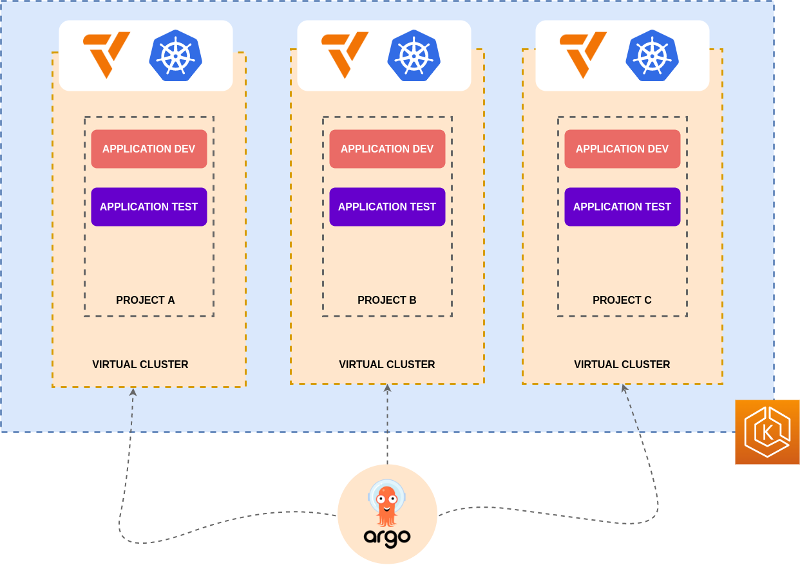

# Creating a scalable foundation for Kubernetes multi-tenancy (ArgoCon-2022)

This repository contains the demo code used for a talk at ArgoCon 2022 by [Kelvin Piroddi](https://github.com/Piroddi) and [Lukonde Mwila](https://github.com/LukeMwila)

## Introduction

One of the biggest challenges when operating Kubernetes at scale is managing unrelated workloads and different teams that share a cluster. In some cases, you might have one big cluster, and in other cases, you might have multiple clusters housing different teams and workloads.
As the projects grow, more people might need access to the cluster(s) (i.e. additional operators, solution architects, QA testers, developers, etc.). If not managed well, this can become a maintenance nightmare.

Using a GitOps strategy with Argo CDs applications, projects and RBAC features enables you to secure access control for different projects and teams, and enables administrators to maintain a variety of applications and clusters (vcluster) from a central place (Git).

This demo achieves a multi tenant environment using a single EKS Kubernetes cluster whist giving different projects their own virtual cluster. This was achieved using [vcluster](https://www.vcluster.com/).

Each virtual cluster is linked to a single project on ArgoCD. ArgoCDs RBAC permissions are then applied to these different clusters and projects.

## Design overview 


## Using this repository 

This repository deploys two vclusters and two applications onto these respective clusters. The steps to achieve this can be found under `argocd-steps`. A make file has been provided to assist running these steps. 
Before running these steps you need a single kubernetes cluster and your kubeconfig set to this cluster. Also, a ArgoCD instance needs to be deployed onto this cluster in a argocd namespace. 

The `utils` folder contains some terraform and helm charts used to deploy a simple EKS cluster and ArgoCD instance for the talks demo. 

## Repository breakdown

### argocd-steps

A sequence of small helm charts used to assist in deploying the architecture in the above image. The numbering of the folders indicates the order in which these charts should be applied.

### Makefile

A makefile used to show all steps needed to be run in order to deploy the above architecture. 
Eg:

```shell
make create-projects 
```

### utils

Utility deployments and configurations used to create the foundation platform. Also contains common helm charts used in *argocd-steps*

- **infrastructure**
  - Deploys a vpc, eks cluster and IAM roles using terraform/terragrunt
- **deploy-argocd** 
  - kustomize manifest used to deploy ArgoCD onto EKS cluster
- **charts**
  - utility charts used for the base platform as well as charts used in *argocd-steps* to create the multiple tenancy cluster.